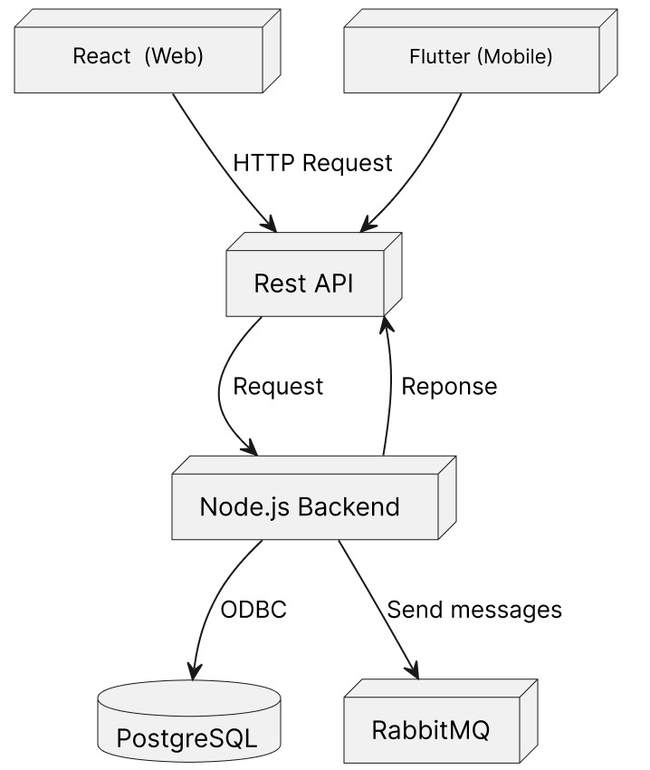
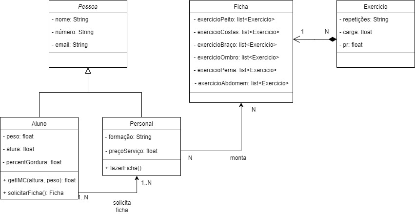

# MuscleUuup

**Caio Elias Rodrigues Araujo**

**Igor Oliveira Costa**

**Henrique Santana Diniz**

**João Vitor Bessa Lacerda**

**João Francisco Almeida de Assis**

**Klaus Leão Teles**

**Lucas Tabosa Guedes**

---

Professores:

**Hugo Bastos de Paula**

**Cleiton Silva Tavares**

**Pedro Pongelupe Lopes**

---

_Curso de Engenharia de Software, Unidade Praça da Liberdade_

_Instituto de Informática e Ciências Exatas – Pontifícia Universidade de Minas Gerais (PUC MINAS), Belo Horizonte – MG – Brasil_

---

**Resumo**. O projeto "MuscleUuup" aborda os desafios da desmotivação causada pela ausência de um plano de treinamento personalizado, da dificuldade em monitorar o progresso e da incapacidade de estabelecer metas realistas e alcançáveis sem orientação profissional. Para isso, utiliza-se uma ferramenta, que proporciona a flexibilidade e a escalabilidade para atender às necessidades da área fitness.

---

## Histórico de Revisões

| **Data** | **Autor** | **Descrição** | **Versão** |
| --- | --- | --- | --- |
| **[28/02/2024]** | [João Assis] | [Resumo e Versão inicial da Seção 1 e Seção 2] | [1.0] |
| **[07/03/2024]** | [Igor Costa] | [Resumo e Versão inicial da Seção 3 ] | [1.1] |

## SUMÁRIO

1. [Apresentação](#apresentacao "Apresentação")  
	1.1. Problema  
	1.2. Objetivos do trabalho  
	1.3. Definições e Abreviaturas  

2. [Requisitos](#requisitos "Requisitos")  
'	2.1. Requisitos Funcionais  
	2.2. Requisitos Não-Funcionais  
	2.3. Restrições Arquiteturais  
	2.4. Mecanismos Arquiteturais  

3. [Modelagem](#modelagem "Modelagem e projeto arquitetural")  
	3.1. Visão de Negócio  
	3.2. Visão Lógica  
	3.3. Modelo de dados (opcional)  

4. [Solução](#solucao "Projeto da Solução")  

5. [Avaliação](#avaliacao "Avaliação da Arquitetura")  
	5.1. Cenários  
	5.2. Avaliação  

6. [Referências](#referencias "REFERÊNCIAS") 

7. [Apêndices](#apendices "APÊNDICES") 

# 1. Apresentação

A busca por uma rotina de exercícios personalizada e eficaz pode ser uma jornada desafiadora para muitas pessoas. Muitas vezes, essa dificuldade decorre da falta de acesso a informações detalhadas sobre programas de treinamento sob medida para suas necessidades específicas. Além disso, a comunicação entre treinadores e alunos pode ser um obstáculo, resultando em falta de clareza sobre objetivos e progresso.

De acordo com pesquisas recentes sobre hábitos de exercício pela Fiocruz, Instituto de Cardiologia Aloysio de Castro e Sydney University, a procura por treinos físicos é alta mas o verdadeiro problema está que cerca de 64% das pessoas abandonam o programa de exercícios no terceiro mês, possivelmente muitas dessas pessoas largaram por falta de não conseguirem estabelecer uma rotina necessária, um plano personalizado e até mesmo dificuldade em acompanhar o progresso. Esses desafios destacam a necessidade urgente de uma abordagem mais acessível e eficiente para ajudar as pessoas a alcançarem seus objetivos de fitness de forma sustentável.

Segundo informações recentes da Tecnofit, uma plataforma líder em gestão fitness no Brasil, a demanda por profissionais que orientem e supervisionem a prática de atividades físicas está em constante crescimento. Dados coletados pelo aplicativo Tecnofit Personal indicam um aumento de 10% na busca por personal trainers a cada mês, destacando um interesse crescente da população em adotar um estilo de vida mais saudável e ativo.

Durante o período de agosto de 2022 a maio de 2023, o mês de setembro registrou o maior número de pesquisas por personal trainers, totalizando mais de 9.300 buscas na plataforma. Desde agosto do ano anterior, mais de 41 mil indivíduos se cadastraram na busca por um treinador, evidenciando uma mudança positiva no cenário brasileiro em relação à prática de exercícios físicos supervisionados.

Esses dados contrastam com as estatísticas divulgadas pela OMS em 2020, que apontavam que quase metade da população brasileira (47%) não praticava o mínimo de exercícios recomendados. A crescente demanda por personal trainers reflete um movimento em direção a hábitos mais saudáveis e ativos, sinalizando uma mudança positiva no comportamento fitness da população brasileira.

Considerando os desafios comuns na manutenção de uma rotina de exercícios e a crescente demanda por profissionais capacitados, o MuscleUuup surge como uma solução abrangente. Compreendendo a falta de um plano personalizado, dificuldade em acompanhar o progresso e a ausência de suporte profissional, o MuscleUuup oferece uma abordagem acessível e eficiente. Fornecendo planos de treinamento adaptados, ferramentas para acompanhar o progresso e acesso a treinadores especializados, o MuscleUuup incentiva hábitos saudáveis e ativos para uma vida melhor.

## 1.1. Problema

A busca por um estilo de vida mais saudável e ativo é uma jornada repleta de desafios substanciais. Entre os problemas mais críticos, destacam-se a desmotivação decorrente da falta de um plano de treinamento personalizado, a dificuldade em monitorar eficazmente o progresso e a frustração ao estabelecer metas alcançáveis. Esses obstáculos combinados criam um cenário desencorajador para aqueles que aspiram aprimorar sua saúde física e bem-estar geral. A ausência de estrutura e suporte especializado ressalta ainda mais a complexidade desse processo, demandando abordagens mais eficazes e soluções adaptadas para cada indivíduo.

Além disso, é crucial reconhecer a necessidade de fornecer suporte adequado para superar esses desafios. Portanto, propomos uma plataforma abrangente que não apenas personaliza planos de treinamento, mas também oferece ferramentas eficazes para monitorar o progresso e estabelecer metas tangíveis, com orientação profissional disponível a qualquer momento.

## 1.2. Objetivos do trabalho

### Objetivo Geral

Desenvolver e implementar a plataforma digital interativa, MuscleUuup, que oferece planos de treinamento personalizados, ferramentas de monitoramento de progresso e conexão com treinadores profissionais. O objetivo é promover a adesão e o sucesso a longo prazo em rotinas de exercícios físicos para usuários com diferentes necessidades e objetivos de fitness.

### Objetivos específicos

 - Criar uma interface de usuário intuitiva e adaptável para diferentes dispositivos (web e mobile), permitindo uma experiência de usuário consistente e agradável. 
 - Implementar um sistema personalizado de criação de planos de treino que seja fácil de  manipular.
 - Desenvolver um mecanismo de acompanhamento de progresso que apresente métricas visuais claras, como gráficos de barra e timelines, para facilitar a compreensão do desenvolvimento pessoal.
 - Estabelecer uma comunicação eficaz entre alunos e treinadores por meio de um sistema de mensagens, convites e notificações, fortalecendo a orientação e o apoio profissional.
 - Integrar um módulo de análise de dados que permita aos usuários e treinadores visualizar e analisar o desempenho em diferentes períodos (semanal, mensal, anual) para ajustar os treinos conforme necessário.
 - Oferecer suporte motivacional por meio de mensagens de incentivo e lembretes de atividades, visando aumentar a adesão e reduzir as taxas de desistência.
 - Assegurar a funcionalidade e a segurança dos dados de usuários e treinadores, mantendo o sistema atualizado e compatível com os principais navegadores e resoluções de tela.
 - Proporcionar formação e recursos contínuos para treinadores na plataforma, garantindo que estejam equipados para oferecer o melhor suporte aos seus clientes.

## 1.3. Definições e Abreviaturas

* (OMS) - Organização Mundial de Saúde
* (ID) - Identificador
* (RNF) - Requisito Não Funcional
* (RF) - Requisito Funcional
* (PR) - Personal Record
* (Gerenciar) - Criar, excluir, editar
* (Interações) - Maneira em que o usuário interage com o sistema

# 2. Requisitos

_Esta seção descreve os requisitos comtemplados nesta descrição arquitetural, divididos em dois grupos: funcionais e não funcionais._

## 2.1. Requisitos Funcionais

 **ID** | **Descrição** | **Prioridade** | **Plataforma** |
| --- | --- | --- | --- |
| RF001| Usuário deve ser capaz de gerenciar treino | Alta | _web e mobile_ |
| RF002 | Usuário deve ser capaz de gerenciar seu cadastro | Alta | _web e mobile_ |
| RF003 | Personal deve ser capaz de ter uma lista de alunos | Alta | _web e mobile_ |
| RF004 | Personal deve ser capaz de gerenciar alunos a sua lista | Alta | _web e mobile_ |
| RF005 | Personal deve ser capaz de atribuir treino a um aluno | Alta | _web e mobile_ |
| RF006 | Personal deve ser capaz de gerenciar treino de um aluno | Alta | _web e mobile_ |
| RF07 | Usuário deve ser capaz de verificar a porcentagem que evoluiu em relação ao peso que levanta em cada exercício por meio de um gráfico de barra| média | _web e mobile_ |
| RF008 | Usuário deve ser capaz de saber a média de tempo que ele gasta na academia por dia| baixa | _web e mobile_ |
| RF009 | Usuário deve ser capaz de verificar a porcentagem que evoluiu em relação a média de peso que levanta em um grupo múscular por meio de um gráfico de barra| baixa | _web e mobile_ |
| RF010 | Usuário deve ser capaz de verificar os dias do mês em que treinou| média | _web e mobile_ |
| RF011 | Usuário deve ser capaz de registrar fotos ao finalizar um treino| baixa | _web e mobile_ |
| RF012 | Usuário deve receber mensagens de apoio sempre que completar um treino| baixa | _web e mobile_ |
| RF013 | Usuário deve receber notificações sempre que ficar muito tempo sem registrar um treino | baixa | _mobile_ |
| RF014 | Personal deve ser capaz de verificar o progresso de seus alunos | Alta | _web e mobile_ |
| RF015 | Usuário deve ser capaz de copiar um treino anterior| Alta | _web e mobile_ |
| RF016 | Usuário deve ser capaz de saber quantos exercícios ele realiza por treino| Alta | _web e mobile_ |
| RF017 | Usuário deve ser capaz de saber a quantidade de vezes que foi na academia na semana | Média | _web e mobile_ |
| RF018 | Usuário deve ser capaz de saber a média de repetições por exercício | Média | _web e mobile_ |
| RF019 | Usuário deve ser capaz de filtrar por tempo de uma semana, um mês, um ano ou pelo máximo de tempo possível todas as informações relacionadas ao seu treino | Alta | _web e mobile_ |
| RF020 | Personal deve ser capaz de se conectar a um aluno por meio de um convite gerado por link | Alta | _web e mobile_ |

## 2.2. Requisitos Não-Funcionais

| **ID** | **Descrição** | **Plataforma** |
| --- | --- | --- |
| RNF001 | O sistema deve permitir que o usuário adicione um exercício a um treino em no máximo três interações | __web e mobile_ |
| RNF002 | O sistema deve permitir que o usuário copie um treino antigo com no máximo duas interações | _web e mobile_ |
| RNF003 | O sistema deve garantir a responsividade para uma resolução de 320px até uma resolução de 2560px | _web_ |
| RNF004 | O sistema deve permitir que o usuário escolha o período de tempo em que quer filtrar as suas informações de treino em até duas interações  | _web e mobile_ |
| RNF005 | O sistema deve garantir a clareza e legibilidade dos gráficos em todas as plataformas, incluindo web e mobile, com um tamanho mínimo de letra de 8px | _web e mobile_ |
| RNF006 | O sistema deve ser compatível com as seguintes versões dos principais navegadores: Chrome 124 e suas três últimas versões, Edge 95 e suas três últimas versões, Safari 17.1 e suas três últimas versões, Firefox 120 e suas três últimas versões, para a plataforma web | _web_ |

## 2.3. Restrições Arquiteturais

As restrições impostas ao projeto que afetam sua arquitetura são:
 - O software deverá ser desenvolvido em Node para o back-end e React para o front-end;
 - Ambos o back-end e front-end devem utilizar como base o TypeScript.
 - O software deve seguir o modelo MVC.
 - O banco de dados utilizado deve ser o PostgreSQL
 - A aplicação móvel deve ser feita em Flutter

## 2.4. Mecanismos Arquiteturais

| **Análise** | **Design** | **Implementação** |
| --- | --- | --- |
| Persistência | Banco de dados relacional | PostgreSQL |
| Front-end | MVC | ReactJS |
| Front-end Mobile | MVC | Flutter |
| Back-end | MVC | TypeScript/Node |
| Integração | Rest | RESTFul |
| Log do sistema | Centralizado | ELK Stack (Elasticsearch, Logstash, Kibana) |
| Teste de Software | Teste Unitário | Jest para testes unitários e de integração |
| Deploy | Ambiente em nuvem | Azure |

# 3. Modelagem e projeto arquitetural

Para resolver o problema proposto, definimos uma estratégia arquitetural que se baseia na utilização de React para o desenvolvimento web e Flutter para a plataforma móvel. Ambos serão empregados no Front-End e integrados na camada do Cliente. Na camada de Aplicação (Application Layer), optaremos pela linguagem Node.js para o desenvolvimento do Back-End. Para garantir uma comunicação eficaz e ágil, utilizaremos a API Rest, o que proporcionará uma economia significativa de tempo e recursos em nosso sistema distribuído.

A comunicação entre a camada do Cliente e a camada de Aplicação será realizada por meio de solicitações HTTP. Como intermediário entre essas duas aplicações, implementaremos um Software Middleware. Ele contribuirá para melhorar a eficiência geral do sistema, simplificando a manutenção por meio de seus serviços de integração, segurança e gerenciamento de rede.

Quanto ao banco de dados, escolhemos o PostgreSQL devido à sua robustez, flexibilidade e confiabilidade. O PostgreSQL é capaz de suportar grandes volumes de dados e atender a uma alta demanda de acesso simultâneo. Além disso, oferece recursos avançados, como suporte a SQL avançado, integridade referencial e transações ACID. Com uma comunidade ativa de desenvolvedores, o PostgreSQL é uma escolha confiável e eficaz para projetos de diferentes tamanhos e complexidades, sendo compatível com diversas plataformas.

**Figura 1 - Visão Geral da Solução (fonte: autor)**

#
## 3.1. Visão de Negócio (Funcionalidades)

    1. O sistema deve ser capaz de criar contas de usuários do tipo “Personal” e “Aluno”.
    2. O sistema deve armazenar dados destes usuários.
    3. O sistema deve ter uma interface ilustrativa que ajude iniciantes de musculação a treinarem.
    4. O sistema deve permitir que personais designem fichas de exercícios para alunos.
    5. O sistema deve mostrar em um gráfico a evolução do aluno, tanto por carga movida nos exercícios quanto por medidas corporais.
    6. O sistema deve checar mensalmente a evolução do aluno.
    7. O sistema deve mostrar a progressão dos alunos para os personais.

## Histórias de Usuário

- Como Personal Trainer, eu quero poder criar fichas de treino personalizadas para cada aluno, para que estes possam seguir um programa de treino adaptado para seus objetivos pessoais.
- Como Personal Trainer, eu quero poder visualizar o progresso dos meus alunos, para que possa instruir eles da melhor maneira.
- Como Aluno, eu quero poder acessar meus treinos personalizados pelo meu personal, para poder treinar da melhor forma possível.
- Como Aluno, eu quero receber minhas atualizações da minha evolução, para que eu saiba se estou indo na direção certa do meu objetivo.
- Como Aluno, eu quero registrar as atividades que realizei, para que eu possa me manter organizado acerca de meus treinos da semana.
- Como Aluno, eu quero registrar que o treino foi feito por meio de fotos, para que eu possa me manter motivado. 
- Como Aluno, eu quero receber notificações de incentivo, para que eu possa me manter motivado.
- Como Personal Trainer, eu quero poder editar os treinos dos meus alunos, para que eles sigam o que foi recomendado por mim, um profissional.
- Como Aluno, eu quero poder anotar os meus treinos com rapidez, podendo copiar muita coisa com facilidade, para que eu ganhe tempo durante o meu treino.
- Como Aluno, eu quero ser capaz de visualizar gráficos que mostrem minha evolução em diversas áreas, para que eu possa acompanhar minha evolução.
- Como Aluno, eu quero ser capaz de encontrar um personal trainer, para que eu possa ter um profissional me acompanhando.
## 3.2. Visão Lógica

### Diagrama de Classes

**Figura 2 – Diagrama de classes (exemplo). Fonte: o próprio autor.**

O diagrama representa a relação entre nossas classes, onde as classes "Aluno" e "Personal" também são da classe "Pessoa" e o "Personal" pode criar diversas fichas de exercicios que são da Classe "Ficha" que contém objetos da classe "Exercicios"

### Diagrama de componentes

Diagrama de componentes
 
- **Solicitar Ficha** - Este componente é ativado pelo usuário quando ele solicita uma ficha de treino. Depende da interface "Ficha" que determina a estrutura da ficha de treino.
- **Visualizar Progresso** - O usuário ao usar a interface IVisualiza para ver seu progresso, ativa o componente que por sua vez se relaciona com outro componente através da interface IGrafico.
- **Gráfico** - O componente Gráfico depende do componente Visualizar Progresso e é responsável por mostrar o desenvolvimento do aluno através de gráficos.
- **Pagar Personl Trainer** - Pagar Personal Trainer é um componente responsável por realizar a transferência monetária do aluno para o personal. Depende da interface "Pagar".

# 4. Projeto da Solução

_Apresente as telas dos sistema construído com uma descrição sucinta de cada uma das interfaces._

# 5. Avaliação da Arquitetura

_Esta seção descreve a avaliação da arquitetura apresentada, baseada no método ATAM._

## 5.1. Cenários

_Apresente os cenários de testes utilizados na realização dos testes da sua aplicação. Escolha cenários de testes que demonstrem os requisitos não funcionais sendo satisfeitos. Os requisitos a seguir são apenas exemplos de possíveis requisitos, devendo ser revistos, adequados a cada projeto e complementados de forma a terem uma especificação completa e auto-explicativa._

**Cenário 1 - Acessibilidade:** Suspendisse consequat consectetur velit. Sed sem risus, dictum dictum facilisis vitae, commodo quis leo. Vivamus nulla sem, cursus a mollis quis, interdum at nulla. Nullam dictum congue mauris. Praesent nec nisi hendrerit, ullamcorper tortor non, rutrum sem. In non lectus tortor. Nulla vel tincidunt eros.

**Cenário 2 - Interoperabilidade:** Pellentesque habitant morbi tristique senectus et netus et malesuada fames ac turpis egestas. Fusce ut accumsan erat. Pellentesque in enim tempus, iaculis sem in, semper arcu.

**Cenário 3 - Manutenibilidade:** Phasellus magna tellus, consectetur quis scelerisque eget, ultricies eu ligula. Sed rhoncus fermentum nisi, a ullamcorper leo fringilla id. Nulla lacinia sem vel magna ornare, non tincidunt ipsum rhoncus. Nam euismod semper ante id tristique. Mauris vel elit augue.

**Cenário 4 - Segurança:** Suspendisse consectetur porta tortor non convallis. Sed lobortis erat sed dignissim dignissim. Nunc eleifend elit et aliquet imperdiet. Ut eu quam at lacus tincidunt fringilla eget maximus metus. Praesent finibus, sapien eget molestie porta, neque turpis congue risus, vel porttitor sapien tortor ac nulla. Aliquam erat volutpat.

## 5.2. Avaliação

_Apresente as medidas registradas na coleta de dados. O que não for possível quantificar apresente uma justificativa baseada em evidências qualitativas que suportam o atendimento do requisito não-funcional. Apresente uma avaliação geral da arquitetura indicando os pontos fortes e as limitações da arquitetura proposta._

| **Atributo de Qualidade:** | Segurança |
| --- | --- |
| **Requisito de Qualidade** | Acesso aos recursos restritos deve ser controlado |
| **Preocupação:** | Os acessos de usuários devem ser controlados de forma que cada um tenha acesso apenas aos recursos condizentes as suas credenciais. |
| **Cenários(s):** | Cenário 4 |
| **Ambiente:** | Sistema em operação normal |
| **Estímulo:** | Acesso do administrador do sistema as funcionalidades de cadastro de novos produtos e exclusão de produtos. |
| **Mecanismo:** | O servidor de aplicação (Rails) gera um _token_ de acesso para o usuário que se autentica no sistema. Este _token_ é transferido para a camada de visualização (Angular) após a autenticação e o tratamento visual das funcionalidades podem ser tratados neste nível. |
| **Medida de Resposta:** | As áreas restritas do sistema devem ser disponibilizadas apenas quando há o acesso de usuários credenciados. |

**Considerações sobre a arquitetura:**

| **Riscos:** | Não existe |
| --- | --- |
| **Pontos de Sensibilidade:** | Não existe |
| _ **Tradeoff** _ **:** | Não existe |

Evidências dos testes realizados

_Apresente imagens, descreva os testes de tal forma que se comprove a realização da avaliação._

# 6. REFERÊNCIAS

_Como um projeto da arquitetura de uma aplicação não requer revisão bibliográfica, a inclusão das referências não é obrigatória. No entanto, caso você deseje incluir referências relacionadas às tecnologias, padrões, ou metodologias que serão usadas no seu trabalho, relacione-as de acordo com a ABNT._

Verifique no link abaixo como devem ser as referências no padrão ABNT:

http://www.pucminas.br/imagedb/documento/DOC\_DSC\_NOME\_ARQUI20160217102425.pdf

**[1]** - _ELMASRI, Ramez; NAVATHE, Sham. **Sistemas de banco de dados**. 7. ed. São Paulo: Pearson, c2019. E-book. ISBN 9788543025001._

**[2]** - _COPPIN, Ben. **Inteligência artificial**. Rio de Janeiro, RJ: LTC, c2010. E-book. ISBN 978-85-216-2936-8._

**[3]** - _CORMEN, Thomas H. et al. **Algoritmos: teoria e prática**. Rio de Janeiro, RJ: Elsevier, Campus, c2012. xvi, 926 p. ISBN 9788535236996._

**[4]** - _SUTHERLAND, Jeffrey Victor. **Scrum: a arte de fazer o dobro do trabalho na metade do tempo**. 2. ed. rev. São Paulo, SP: Leya, 2016. 236, [4] p. ISBN 9788544104514._

**[5]** - _RUSSELL, Stuart J.; NORVIG, Peter. **Inteligência artificial**. Rio de Janeiro: Elsevier, c2013. xxi, 988 p. ISBN 9788535237016._

**[6]** - _DINO; **Estudo da OMS aponta que 47% dos brasileiros não praticam atividades físicas regularmente**. 19/02/2021. Website (Terra)._

**[7]** - _Ojea, Gabriel; **Atividade física supervisionada: busca por personal trainers cresce no Brasil**. 15/07/2023. Curitiba: Website (Jornal Tribuna)._

**[8]** - _TECNOFIT; **Tendências Fitness 2024: Insights da Pesquisa Global da ACSM**. 12/01/2024. Website._

**[9]** - _Pompeo, Carolina; **Na “Era Fitness”, apenas 3,7% dos alunos permanecem um ano na academia**. 08/04/2016. Website (Gazeta do Povo)._

# 7. APÊNDICES

_Inclua o URL do repositório (Github, Bitbucket, etc) onde você armazenou o código da sua prova de conceito/protótipo arquitetural da aplicação como anexos. A inclusão da URL desse repositório de código servirá como base para garantir a autenticidade dos trabalhos._
